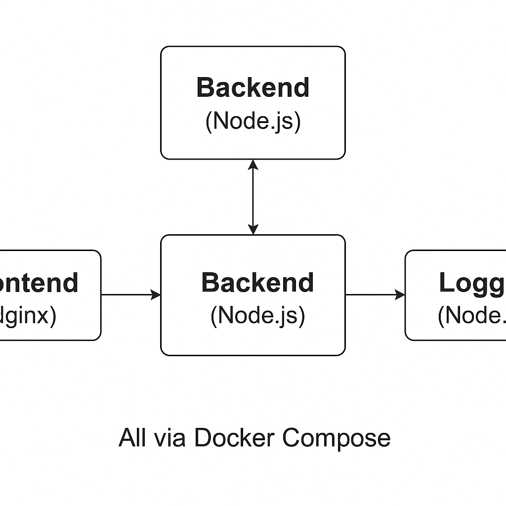

# 🐳 DevOps Fullstack Demo

[](https://devops-app-tal.netlify.app/)
[](https://hub.docker.com/u/taltal1131)

A complete **DevOps-ready fullstack application** that demonstrates containerized microservices, CI/CD automation with GitHub Actions, and live deployment using Docker Compose & Netlify.

---

## 📦 Project Structure

devops-full-app/
├── frontend/ → Static HTML served via Nginx
├── backend/ → Node.js REST API
├── logger/ → Node.js logging microservice
├── docker-compose.yml
└── .github/workflows/docker-ci.yml

yaml
Copy
Edit

---

## 🗺️ Architecture Diagram



---

## 🚀 Features

- 🐳 Multi-container architecture using Docker & Compose  
- ⚙️ CI/CD with GitHub Actions (build & push to Docker Hub)  
- 🌐 Live deployment of frontend to Netlify  
- 🧩 Microservices pattern with backend & logger  
- 📁 Clean, modular project structure  
- ✅ Perfect for DevOps portfolio/demo

---

## 📂 Services

| Service  | Port | Description                          |
|----------|------|--------------------------------------|
| frontend | 8080 | Static HTML served with Nginx        |
| backend  | 3000 | Node.js Express API (`/` returns JSON) |
| logger   | 4000 | Node.js microservice with status API |

---

## 🧩 Service Descriptions

- **Frontend**: Static landing page served via Nginx and deployed to Netlify.  
- **Backend**: REST API built with Node.js and Express.  
- **Logger**: Microservice responsible for system logging and monitoring.

---

## ⚙️ Technologies Used

- Docker & Docker Compose  
- Node.js + Express  
- Nginx (for frontend)  
- GitHub Actions (CI/CD)  
- Docker Hub (image registry)  
- Netlify (frontend deployment)

---

## 🧪 How to Run Locally

```bash
git clone https://github.com/taltal1131/devops-full-app.git
cd devops-full-app
docker-compose up --build
Visit: http://localhost:8080 → Frontend

Visit: http://localhost:3000 → Backend API

Visit: http://localhost:4000 → Logger Microservice

👨‍💻 Author
Tal Amsalem
DevOps Enthusiast | Always Learning | Building Production-Ready Pipelines 🚀
[](https://hub.docker.com/u/taltal1131)