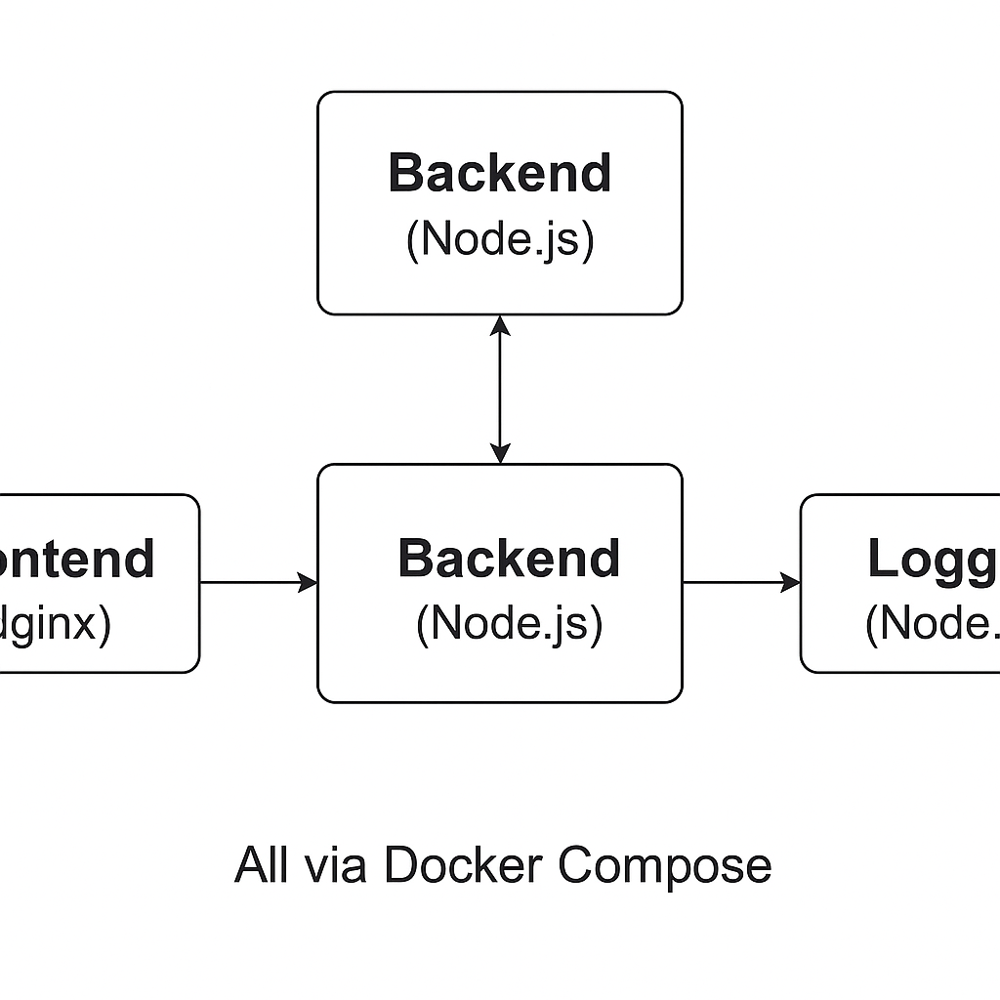

# 🐳 DevOps Fullstack Demo

A fully containerized fullstack demo built for learning and practicing DevOps –  
includes CI/CD pipelines, Docker Compose, and microservice separation.  
Perfect for portfolio and interview showcase.

---

## 🔗 Live Links

- 🌐 [Live Frontend on Netlify](https://your-netlify-link.netlify.app) *(coming soon)*
- 🐳 [Docker Hub Images](https://hub.docker.com/u/taltal1131)

---

## 📦 Project Structure

```
devops-full-app/
├── frontend/         # Static HTML served via Nginx
├── backend/          # Node.js REST API
├── logger/           # Logging microservice (Node.js)
├── docker-compose.yml
└── .github/workflows/docker-ci.yml
```

---

## 🗺️ Architecture Diagram



---

## 🚀 Features

- 🐳 Multi-container architecture using Docker & Compose
- ⚙️ CI/CD with GitHub Actions (build & push to Docker Hub)
- 🌐 Live deployment of frontend to Netlify
- 🧩 Microservices pattern with backend & logger
- 📁 Clean, modular project structure
- ✅ Perfect for DevOps portfolio/demo

---

## 📂 Services

| Service   | Port | Description                            |
|-----------|------|----------------------------------------|
| frontend  | 8080 | Static HTML served with Nginx          |
| backend   | 3000 | Node.js Express API (`/` returns JSON) |
| logger    | 4000 | Logging microservice with status API   |

---

## ⚙️ Technologies Used

- Docker & Docker Compose
- Node.js + Express
- Nginx (for frontend)
- GitHub Actions (CI/CD)
- Docker Hub (image registry)
- Netlify (frontend deployment)

---

## 🧪 How to Run Locally

```bash
git clone https://github.com/taltal1131/devops-full-app.git
cd devops-full-app
docker-compose up --build
```

Then open:

- 🌐 http://localhost:8080 → Frontend
- 📡 http://localhost:3000 → Backend API
- 📋 http://localhost:4000 → Logger Microservice

---

## 👨‍💻 Author

**Tal Amsalem**  
DevOps Enthusiast | Always Learning | Building Production-Ready Pipelines 🚀  
[GitHub](https://github.com/taltal1131)

